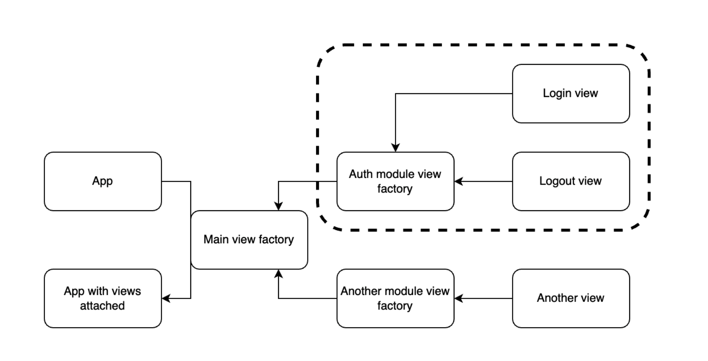

# Basic Web Application

- Our web application is following file layout:
```
├── Cargo.lock
├── Cargo.toml
└── src
    ├── main.rs
    └── views
        ├── auth
        │   ├── login.rs
        │   ├── logout.rs
        │   └── mod.rs
        └── mod.rs
```
- `main.rs`: the entry point for the server where the server is defined
- `views/auth/login.rs`: the code defining the view for logging in
- `views/auth/logout.rs`: the code defining the view for logging out
- `views/auth/mod.rs`: the factory that defines the views for `auth`
- `views/mod.rs`: the factory that defines all the views for the whole app